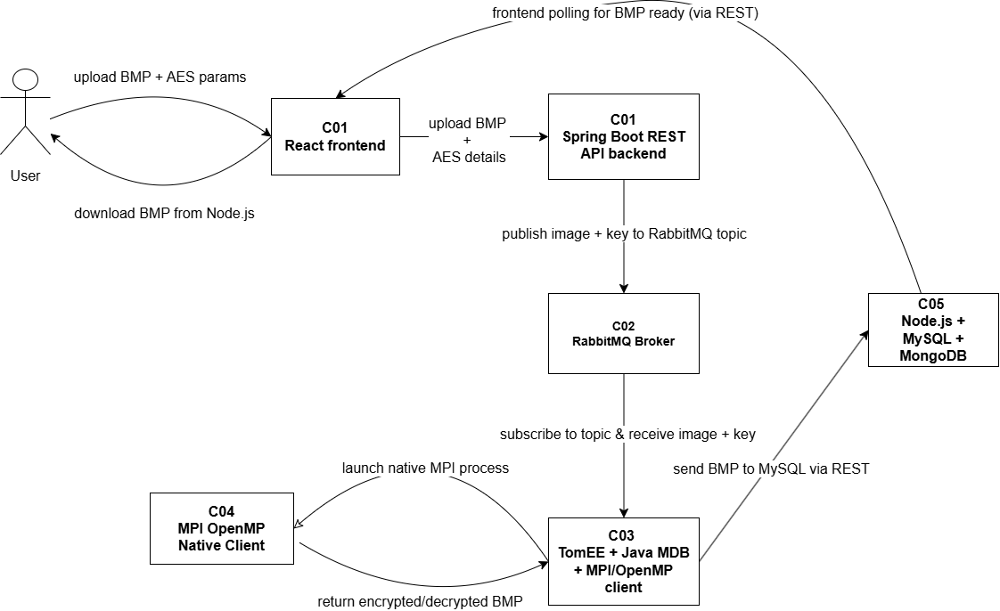

# ism-web-cloud-distributed-parallel-systems
# AES BMP Encryption/Decryption Distributed System

This project implements a distributed system for encrypting and decrypting large BMP images using symmetric AES keys.  
It consists of multiple Docker containers communicating via RabbitMQ and REST APIs, leveraging Java, native MPI/OpenMP parallel processing, Node.js, and databases (MySQL + MongoDB).

---

## Workflow Diagram



---

## Running the Application

### Build and Start the System

From the project root directory, run:

```bash
docker-compose up --build
```
## Access the Web Interface (Frontend)

Open your browser and go to:

```plaintext
http://localhost
```
## Access RabbitMQ Management Console
Monitor queues and messages at:
```
http://localhost:15672
```
Login credentials:
```
Username: angelica

Password: angelica123
```
